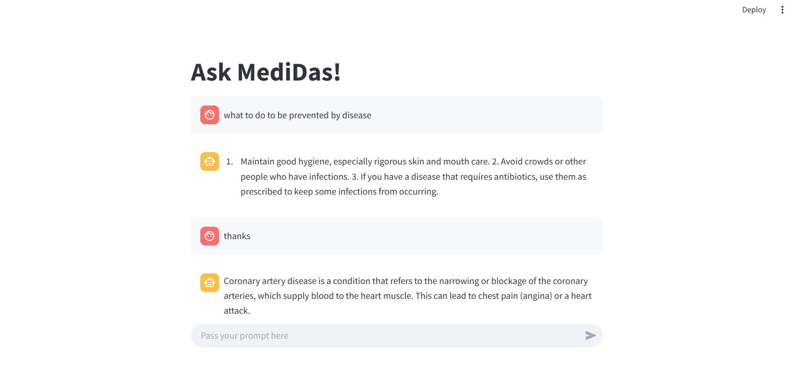

# 

# Medidas: Retrieval-Augmented Generation for Medical Insights

## Overview
Medidas is a Retrieval-Augmented Generation (RAG) application designed to provide efficient medical insights from uploaded PDFs. By leveraging vector-based retrieval and AI-powered responses, Medidas enhances information accessibility for medical professionals and researchers.

## Features
- 📄 **PDF Ingestion**: Upload medical research papers, reports, or clinical documents.
- 🔍 **Vector-Based Retrieval**: Uses FAISS to store and retrieve relevant text chunks.
- 🤖 **AI-Generated Responses**: Mitral-7B LLM (via API) processes queries for contextual answers.
- 🎨 **Streamlit UI**: Provides an intuitive and interactive web interface.
- ⚡ **Efficient Search**: Quickly finds relevant medical insights from uploaded documents.

## Tech Stack


- **Frontend & UI**: Streamlit
- **Vector Database**: FAISS (Facebook AI Similarity Search)
- **Language Model**: Mitral-7B (via API)
- **Framework**: LangChain
- **Document Handling**: PDF Loader

## Installation Guide
1. **Clone the Repository**
   ```bash
   git clone https://github.com/your-repo/medidas.git
   cd medidas
   ```
2. **Set Up Virtual Environment**
   ```bash
   python -m venv venv
   source venv/bin/activate  # On Windows: venv\Scripts\activate
   ```
3. **Install Dependencies**
   ```bash
   pip install -r requirements.txt
   ```
4. **Set Environment Variables**
   ```bash
   export MITRAL7B_API_KEY='your_api_key_here'
   export FAISS_INDEX_PATH='path_to_faiss_index'
   ```
5. **Run the Application**
   ```bash
   streamlit run app.py
   ```

## Usage Guide


1. **Upload PDFs**: Drag and drop a PDF file into the application.
2. **Indexing**: The document is processed, and embeddings are stored in FAISS.
3. **Query**: Enter a medical-related query in the search box.
4. **Response**: The AI retrieves relevant text and generates an insightful response.

## Architecture


1. **User uploads a PDF** → Processed into text chunks.
2. **Text chunks are embedded** → Stored in FAISS for efficient retrieval.
3. **Query input** → FAISS retrieves relevant chunks.
4. **Chunks are passed to Mitral-7B** → AI generates a contextual response.
5. **Response displayed in Streamlit UI**.

## API & Configuration
- **Mitral-7B API**: Requires an API key for authentication.
- **Environment Variables**:
  - `MITRAL7B_API_KEY`: Your API key for the Mitral-7B model.
  - `FAISS_INDEX_PATH`: Path to store and load FAISS indexes.
  
## Screenshots


## Future Improvements
- 📌 Support for multiple document formats (DOCX, TXT, etc.).
- 🔬 Enhanced summarization capabilities.
- 📊 Fine-tuned retrieval using domain-specific embeddings.
- 🔐 Multi-user support with authentication.

## Contributing
1. Fork the repository.
2. Create a new branch (`git checkout -b feature-name`).
3. Commit changes (`git commit -m 'Add new feature'`).
4. Push to the branch (`git push origin feature-name`).
5. Create a pull request.

## License & Credits
- **License**: MIT License
- **Acknowledgments**:
  - 🎯 LangChain for workflow automation.
  - 📂 FAISS for vector-based retrieval.
  - 🤖 Mitral-7B API for AI-driven responses.
  - 🖥️ Streamlit for UI development.

---
**Medidas** simplifies the extraction of valuable medical knowledge, making it a powerful tool for healthcare and research professionals.

